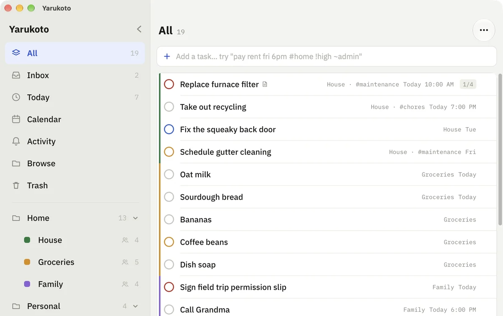

# Yarukoto

A self-hosted todo app. One container, one SQLite file, your data on your own server.

The server serves both the API and the web client, so a single `docker compose up` gives you
a working instance. The same codebase builds the iOS, Android and Mac apps via Expo.



**[Documentation](https://docs.yarukotoapp.com)** · [Live demo](https://wyne.github.io/yarukoto/) ·
[Website](https://yarukotoapp.com) · [Roadmap](ROADMAP.md)

> **Status:** working and usable, but young. One household per server: everyone gets their own
> account and private lists, and signs in by QR code rather than password. See
> [Limitations](https://docs.yarukotoapp.com/reference/limitations/) before trusting it with
> anything important.

## Features

- **Lists, folders, tags and saved filters**, with Today, Upcoming, Inbox, Plan and Calendar views.
- **Quick add with natural syntax**: `pay rent fri 6pm #home !high ~admin` sets the date, time,
  tag, priority and list.
- **Native apps** for iPhone, Android and the Mac, plus the web app the server hosts.
- **A household**: everyone gets private lists and an Inbox, shares the lists they choose, and
  signs in by QR code.
- **Offline-tolerant sync**: the app never waits on the network, and changes push when the server
  is reachable.
- **Trash, history and daily backups**, so a mistake is recoverable.
- **Home Assistant** to-do lists through a [HACS integration](https://docs.yarukotoapp.com/integrations/home-assistant/),
  and **AI assistants** through a built-in [MCP server](https://docs.yarukotoapp.com/integrations/ai-assistants/).

## Quick start

Requires Docker with Compose v2. The compose file pulls the prebuilt `ghcr.io/wyne/yarukoto`
image (amd64 and arm64).

```bash
git clone https://github.com/wyne/yarukoto.git
cd yarukoto
echo "YARUKOTO_TOKEN=$(openssl rand -hex 32)" > .env
docker compose up -d
```

Open <http://localhost:8080> and paste the token from `.env`. The
[installation guide](https://docs.yarukotoapp.com/getting-started/docker/) covers updating and
building from source, and there are separate steps for a
[Synology NAS](https://docs.yarukotoapp.com/getting-started/synology/).

## Documentation

- **Self-hosting:** [configuration](https://docs.yarukotoapp.com/self-hosting/configuration/),
  [HTTPS and reverse proxies](https://docs.yarukotoapp.com/self-hosting/reverse-proxy/),
  [backups](https://docs.yarukotoapp.com/self-hosting/backups/)
- **Reference:** [REST API](https://docs.yarukotoapp.com/reference/api/),
  [limitations](https://docs.yarukotoapp.com/reference/limitations/)
- **Development:** [setup](https://docs.yarukotoapp.com/development/setup/),
  [architecture and sync](https://docs.yarukotoapp.com/development/architecture/),
  [feature compatibility](https://docs.yarukotoapp.com/development/feature-compatibility/),
  [iOS and Android builds](https://docs.yarukotoapp.com/development/ios-and-android/),
  [the Mac app](https://docs.yarukotoapp.com/development/mac/),
  [the Windows app](https://docs.yarukotoapp.com/development/windows/)

The docs are Markdown in [`docs/`](docs/), so a change and its documentation land in the same pull
request. Merging to `main` publishes them.

## Repo layout

```
client/             Expo + React Native client for web, iOS, Android, and Mac
server/             Fastify + better-sqlite3 API server
packages/domain/    Types and domain logic shared by the client and server
windows/            Tauri shell that packages the web build as a Windows app
docs/               The documentation site (Starlight)
custom_components/yarukoto/   Home Assistant integration (installed through HACS)
homeassistant-tests/          its tests
```

The JavaScript projects are one npm workspace. Run `npm install` once at the repository root,
then use the root scripts or target an individual package with `npm --workspace`.
